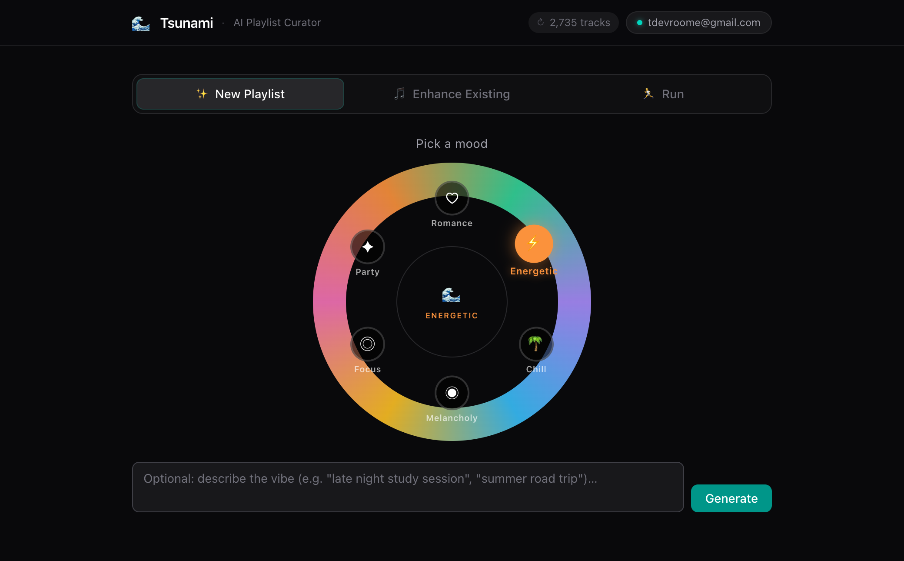
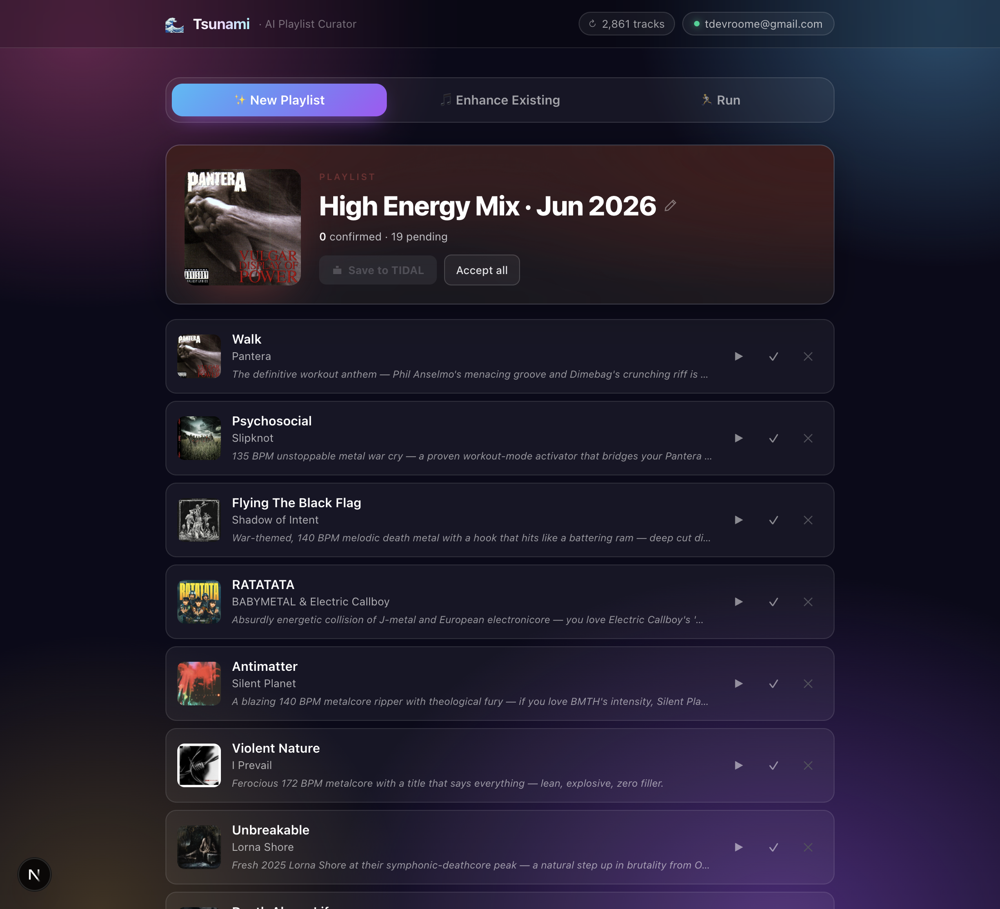
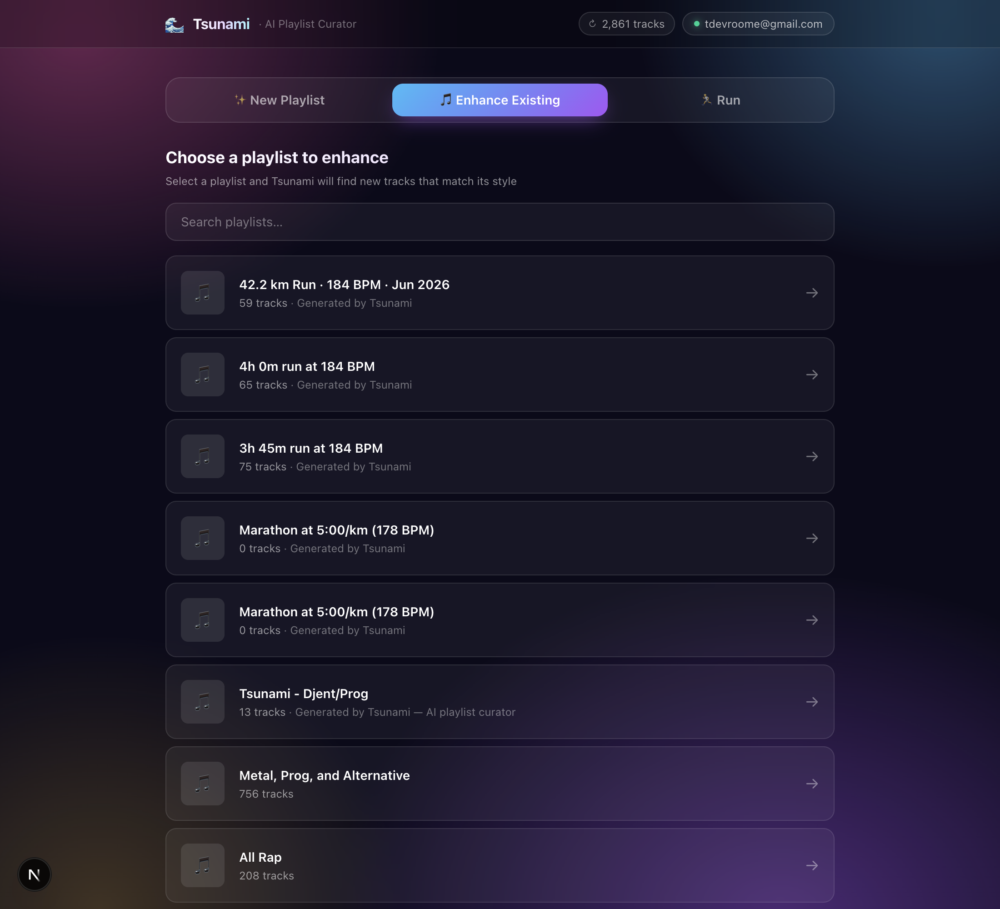
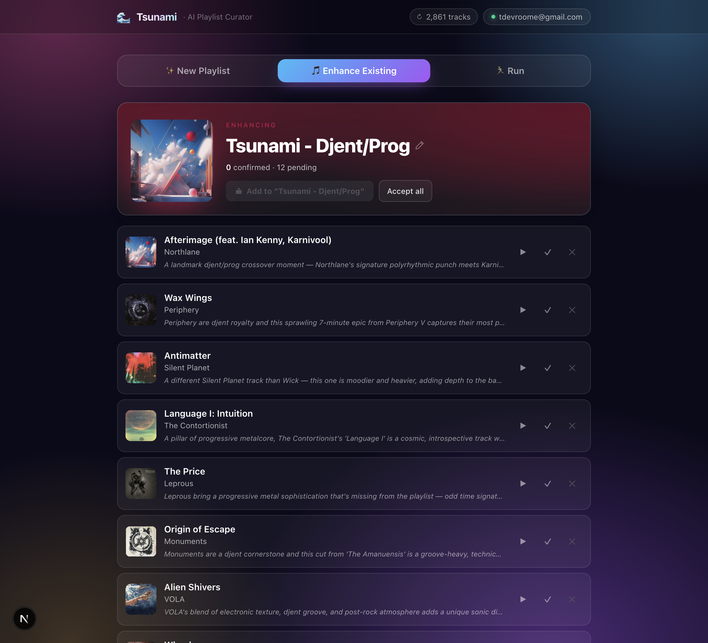
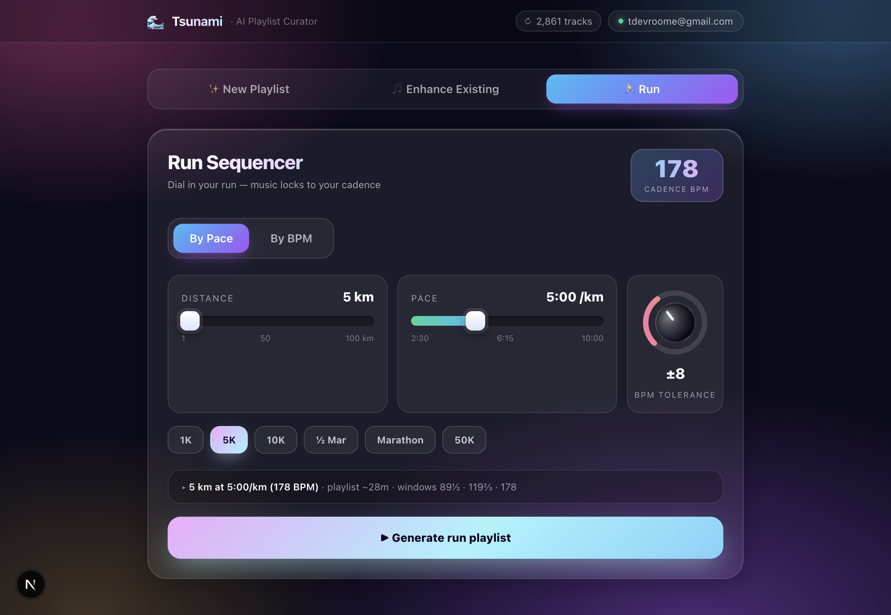

# 🌊 Tsunami

**A Claude-powered playlist generator and curator for TIDAL — with a local, tunable recommendation engine.**

Tsunami pairs Anthropic's Claude with a **local model of your TIDAL listening** to build playlists that expand your taste rather than rehashing the songs you already love. It syncs your library into SQLite, ranks it **locally** (recency + play-frecency + novelty, no LLM in the hot path), DJ-sequences the result for smooth flow, and only then hands a curated pool to Claude. Tell it a mood, set a running pace, or point it at an existing playlist.

The ranking is **not hard-coded magic** — it's a transparent weighted scorer you can A/B-test and retune to your own taste from a built-in [tuning page](#-tailoring-recommendations-the-tuning-page).

---

## 🎧 Three ways to build a playlist

Tsunami is three modes behind one tab bar. They share the same engine — your locally-ranked TIDAL library, Claude's curation, and DJ-style sequencing — but each is tuned for a different moment.

### ✨ New Playlist — start from a mood

Spin the mood wheel — romance, energetic, chill, melancholy, focus, party — and Claude assembles a 15–20 track playlist from your locally-ranked favourites, deliberately leaning into deeper cuts over the obvious hits. Tracks stream in live, each with a one-line *reason* for the pick, a smart editable name, and one-tap **accept / skip** before you save straight back to TIDAL.

| Spin the mood wheel | Curated, sequenced & named |
| --- | --- |
| [](docs/screenshots/01-create-mood.png) | [](docs/screenshots/02-create-playlist.png) |

### 🎵 Enhance Existing — grow a playlist you already love

Point Tsunami at any playlist in your TIDAL account and it reads that playlist's "musical DNA," then suggests new tracks that match its style **without duplicating what's already there**. Keep the ones that land and append them in place — your existing order stays intact.

| Pick a playlist | Additions that match its style |
| --- | --- |
| [](docs/screenshots/03-enhance-picker.png) | [](docs/screenshots/04-enhance-result.png) |

### 🏃 Run — music locked to your cadence

Dial in a distance and pace (or a direct BPM) and the DJ-desk turns it into a running cadence with tempo-matched windows (half-time / two-thirds / full). The sliders stretch all the way — a 1K sprint to a **100K ultra**, world-record marathon pace down to a 10:00/km plod, and runs up to **10 hours** — and Tsunami fills a playlist long enough to cover the whole distance, BPM-matched and beat-sequenced so the tempo carries you.

[](docs/screenshots/05-run-config.png)

> **Don't like a pick?** In every mode, skipping a track surfaces 3–5 alternatives that fit *that slot* in the flow — Run matches them locally by BPM, Create/Enhance use TIDAL radio seeded from the track and its neighbours. Swap one in-place, or drop it entirely.

---

## ✨ Features

*   **Create mode** — Pick a mood (romance, energetic, chill, melancholy, focus, party) and Claude generates a 15–20 track playlist seeded from your locally-ranked favourites.
*   **Enhance mode** — Point Tsunami at an existing TIDAL playlist. It analyses the playlist's "musical DNA" and suggests new tracks that fit without duplicating what's already there.
*   **Run mode** — Enter a distance and pace (or a direct BPM target). Tsunami computes your running cadence, picks tempo-compatible tracks (half-time / two-thirds / full-cadence windows), and builds a playlist long enough to cover the whole run.
*   **Local recommendation engine** — A synced SQLite library is ranked in milliseconds by a weighted scorer biased toward what you've **added recently** and **play often** — see [How recommendation ranking works](#-how-recommendation-ranking-works).
*   **DJ-style sequencing** — The chosen tracks are ordered for smooth tempo/key transitions, with the same artist spaced apart and style clusters kept short.
*   **Tunable to your taste** — A built-in [`/tuner.html`](#-tailoring-recommendations-the-tuning-page) harness lets you A/B weight configs against your real library, flag tracks, and bake the winners into the defaults.
*   **Discovery-first curation** — A deliberate prompt mandate ensures the majority of Claude's suggestions are _new_ discoveries and deeper cuts, not just the obvious hits.
*   **Interactive feedback loop** — Accept or skip individual tracks; free-form feedback ("more upbeat", "less mainstream") steers the next round.
*   **Smart track swap** — Skipping a track first offers 3–5 alternatives that suit its slot in the flow (Run matches them locally by BPM; Create/Enhance use TIDAL radio seeded from the track and its neighbours). Swap one in-place, or remove it entirely.
*   **Real-time streaming** — Curation progress and tracks stream into the UI live via Server-Sent Events.
*   **Name & save back to TIDAL** — Every playlist gets a smart default name (mood + month, or the run cadence) you can edit inline before saving; create a new playlist from accepted tracks, or append to the playlist you're enhancing.

---

## 🏗️ How it works

```
┌──────────────┐     SSE      ┌─────────────────────┐    HTTP    ┌──────────────────┐
│   Browser    │ ◀──────────▶ │  Next.js API routes │ ◀────────▶ │  TIDAL MCP server │
│  (React UI)  │              │  /api/generate      │            │  (tidal-mcp,      │
│  /tuner.html │              │  /api/run /enhance  │            │   local, :5100)   │
└──────────────┘              │  /api/recommend ... │            └──────────────────┘
                              └─────────┬───────────┘
                          ┌─────────────┴──────────────┐
                          │                            │
                          ▼                            ▼
                 ┌──────────────────┐         ┌──────────────────┐
                 │  SQLite library  │         │  Claude          │
                 │  (data/library)  │         │  (Anthropic)     │
                 │  local ranking   │         │  curation + tools│
                 └──────────────────┘         └──────────────────┘
```

1.  A **sync** pulls your favourites, listening-history mixes, and (optionally) playlists from TIDAL into `data/library.db`.
2.  The **local recommender** (`lib/recommender.ts`) scores and ranks that library — no LLM, no network — producing a candidate pool biased toward recent adds and heavy rotation.
3.  The **sequencer** (`lib/sequencer.ts`) orders the chosen tracks for smooth flow.
4.  For Create/Run/Enhance, the ranked pool is handed to **Claude** (with TIDAL tools) to curate and fill out the playlist; the result streams back to the UI.
5.  Accepted tracks are written back to TIDAL through the MCP server.

> The local recommender is also exposed **standalone** at `GET /api/recommend` — pure SQLite scoring with no LLM call. This is the fast path used by the [tuning page](#-tailoring-recommendations-the-tuning-page).

---

## 🎯 How recommendation ranking works

All ranking happens locally over the synced SQLite library. The pipeline is:

```
candidate pool  →  merge same-recording duplicates  →  score each track  →  sort  →  cap per artist  →  sequence
  (db.ts)              (recommender.ts)                   (recommender.ts)            (recommender.ts)   (sequencer.ts)
```

### 1. The candidate pool

`getRecommenderPool()` joins every scoring signal in one SQL pass (`lib/db.ts`):

| Signal | Source | Meaning |
| --- | --- | --- |
| `added_at` | `favorites` | Real timestamp you saved the track |
| `added_rank` | `favorites` | Position in your favourites (0 = most recently added) — a fallback when `added_at` is missing |
| `is_favorite` | `favorites` | Whether it's a saved favourite at all |
| `in_alltime` / `in_yearly` | `track_history` | Membership in your all-time / yearly TIDAL **history mixes** |
| `monthly_months` | `track_history` | Which monthly history mixes it appears in (`month_index` list; 0 = this month) |
| `best_mix_rank` | `track_history` | Its best (lowest) position across any history mix |

Optional filters: BPM windows (for Run mode) and "favourites only".

> **Why history mixes?** TIDAL doesn't expose raw play counts, but its `HISTORY_*` mixes are a play-frequency/recency proxy: a track recurring across many monthly mixes (and ranking high in them) is one you play a lot, lately.

### 2. Merge same-recording duplicates

The same recording can exist under several TIDAL IDs (single vs. album vs. remaster). `mergeByRecording()` groups them by **ISRC** (falling back to artist + title) and combines their signals, so "recently added" (your favourite's ID) and "played a lot" (the history mix's ID) **compound onto one row** instead of splitting into near-duplicates. The favourite instance is kept as canonical.

### 3. Score each track

`scoreTrack()` is a transparent linear sum of five terms:

```
total = recency + favorite + play + popularity + novelty
```

| Term | Formula | What it rewards |
| --- | --- | --- |
| **recency** | `recencyAdd × 2^(−ageDays / recencyHalfLifeDays)` (or rank-based fallback `2^(−added_rank / recencyRankHalfLife)`) | Tracks you saved recently |
| **favorite** | `favoriteBoost × is_favorite` | Being a saved favourite at all (the "spine") |
| **play** | `playAlltime·in_alltime + playYearly·in_yearly + Σₘ playMonthly·e^(−m / monthlyDecayTau) + playRankBonus·1/(1+best_mix_rank)` | Heavy, recent rotation (frecency). Multiplicity across monthly mixes accumulates; recent months decay slower |
| **popularity** | `popularity × (global_popularity / 100)` | A weak global prior (tuned near-zero) |
| **novelty** | `novelty × random()` | Exploration / tie-breaking — re-running reshuffles ties **by design** |

### 4. Diversify & sequence

- `capPerArtist()` caps how many tracks per artist make the list (`maxPerArtist`, default 2) while preserving score order.
- The top `limit` tracks are then passed to the **sequencer** (`lib/sequencer.ts`), which orders them to minimise adjacent-transition cost across **tempo** (BPM), **harmonic key** (Camelot wheel derived from the synced musical key), and **style** (genre / audio-feature distance from enrichment), while keeping the same artist `artistGap` positions apart (default 3) and capping consecutive same-style tracks (`maxStyleRun`, default 3). The style term activates once [genre enrichment](#2-enrich-with-genremood--optional) has run.

### 5. The tuned defaults

`DEFAULT_WEIGHTS` in `lib/recommender.ts`, arrived at over two rounds of live tuning:

```ts
recencyAdd: 3.0,   favoriteBoost: 2.5,
playAlltime: 0.8,  playYearly: 0.8,  playMonthly: 0.7,  playRankBonus: 0.6,
popularity: 0.1,   novelty: 1.5,
recencyHalfLifeDays: 120,  recencyRankHalfLife: 150,  monthlyDecayTau: 3,
```

**Character:** your saved favourites are the spine, tilted toward recent adds, with listening-history play as reinforcement and a healthy novelty term for variety. Popularity is near-zero — popularity-driven results tested as off-taste.

**Every weight is overridable per request** as a query param on `/api/recommend`, so you can A/B without touching code:

```bash
# Inspect the local ranking with a custom weighting (no LLM, no TIDAL round-trip):
curl -s 'http://localhost:3000/api/recommend?explain=1&limit=25&recencyAdd=3&playMonthly=1.2&novelty=1.5&sequence=1'
```

Supported params: every weight key above, plus `limit`, `maxPerArtist`, `favoritesOnly=1`, `bpm` & `tol` (Run-style windows), `sequence=0` (skip DJ ordering), `artistGap`, `maxStyleRun`, and `explain=1` (include the per-term score breakdown).

---

## 🎛️ Tailoring recommendations: the tuning page

Tsunami ships a standalone **Recommender Tuner** at **<http://localhost:3000/tuner.html>** (`public/tuner.html`). This is the exact page used to train the current `DEFAULT_WEIGHTS` — it runs the local recommender against **your** library so you can see, flag, and retune the ranking to your own ear.

### What it does

- Presents a **battery of weight presets** (A–F), each with a hypothesis and a "look for" prompt, plus an **editable params box** so you can tweak any weight on the fly.
- **Run test** calls `GET /api/recommend?explain=1&limit=…&<your params>` and renders the ranked tracks in a table with a **per-signal breakdown** (recency / play / popularity / favourite / date-added) so you can see *why* each track ranked where it did.
- For each track you can cycle a **flag**: 👍 love · 🕰 too old · 🚫 not played · ❓ unexpected.
- For each preset you record a **verdict** (✓ Good / ~ Mixed / ✗ Bad) and free-form commentary.
- Everything **auto-saves** to `nimbalyst-local/tuning/round-<N>.json` via `POST /api/tuning` (and reloads restore it). **Download JSON** exports a round for your records.

The committed `nimbalyst-local/tuning/round-1.json` and `round-2.json` are the real feedback that shaped the defaults (e.g. "popularity… doesn't match my taste", "monthly is my strongest play signal", "all-time lost my metal") — useful as worked examples.

### Tailor your own — step by step

1.  **Sync first.** The tuner needs favourites + history present, or `/api/recommend` returns `409`:
    ```bash
    curl -N -X POST http://localhost:3000/api/library/sync \
      -H 'Content-Type: application/json' -d '{"mode":"full"}'
    ```
2.  **Open** <http://localhost:3000/tuner.html>.
3.  **Work through the battery.** For each preset: click **▶ Run test**, read the results, **flag** tracks that feel wrong (too old / not actually played / surprising) and ones you **love**, set a **verdict**, and jot *why* in the comment. Hit **Save & next →**.
4.  **Experiment freely.** Edit the params box on any preset (or use preset **F · Your call**) to push or cut a weight, change a half-life, or tighten `maxPerArtist`, then re-run. Note what you changed in the comment so the round is self-documenting.
5.  **Read the signal.** Compare verdicts and flags across presets. The breakdown columns tell you which term is driving a bad pick (e.g. lots of `pop` on tracks you don't recognise → cut `popularity`; stale tracks ranking high → shorten `recencyHalfLifeDays` or raise `recencyAdd`).
6.  **Iterate in a new round.** To start a fresh round, bump the `ROUND` constant near the top of `public/tuner.html` and adjust the `BATTERY` array of presets to probe what the last round raised. Each round persists to its own `round-<N>.json`.
7.  **Lock in the winner.** Once a configuration consistently earns ✓ Good, either:
    - **edit `DEFAULT_WEIGHTS`** in `lib/recommender.ts` to make it the app-wide default (what Create/Run/Enhance use), or
    - **pass it per call** as query params on `/api/recommend` when you want a one-off weighting without changing the default.

> **Tip:** because `novelty` injects randomness, re-running the *same* preset reshuffles ties on purpose. Judge the overall character across a couple of runs, not the exact order.

---

## 🙏 Acknowledgements

Tsunami's TIDAL connectivity is built on top of the excellent [**tidal-mcp**](https://github.com/yuhuacheng/tidal-mcp) project by [**yuhuacheng**](https://github.com/yuhuacheng), which handles TIDAL authentication, favourites, recommendations, and playlist management over a local HTTP API. Please go star their repo. 🌟

> Tsunami talks to tidal-mcp's HTTP REST API (`tidal_api/app.py`), which it runs as a local sidecar process. **BPM analysis runs in a second local sidecar** ([`bpm-service/`](bpm-service/)) — ffmpeg + librosa kept out of the lean TIDAL shim — that fills gaps where TIDAL has no native BPM. Both start automatically with `npm run dev`.

---

## 📋 Prerequisites

*   **Node.js 20+** (Next.js 16 requires Node 20.9+)
*   **Python** with [**uv**](https://github.com/astral-sh/uv) — to run the tidal-mcp server
*   A local clone of [**tidal-mcp**](https://github.com/yuhuacheng/tidal-mcp)
*   An **Anthropic API key**
*   A **TIDAL account**

---

## 🚀 Getting started

### 1. Clone the TIDAL MCP server

```bash
git clone https://github.com/yuhuacheng/tidal-mcp.git
```

Follow its README to install dependencies (it uses `uv`).

### 2. Install Tsunami's dependencies

```bash
npm install
```

### 3. Configure environment variables

Create a `.env.local` in the project root:

```bash
# Required — your Anthropic API key
ANTHROPIC_API_KEY=sk-ant-...

# Optional — where the tidal-mcp HTTP server is reachable (default: http://127.0.0.1:5100)
TIDAL_API_URL=http://127.0.0.1:5100
```

### 4. Point the dev script at your tidal-mcp clone

The `tidal` script in `package.json` launches the MCP server. It defaults to a sibling `../tidal-mcp` clone — if yours lives elsewhere, set `TIDAL_MCP_DIR` instead of editing `package.json`:

```jsonc
"tidal": "cd \"${TIDAL_MCP_DIR:-../tidal-mcp}\" && TIDAL_MCP_PORT=5100 uv run python tidal_api/app.py",
```

```bash
# Clone is somewhere other than ../tidal-mcp? Point at it (and make sure uv is on PATH):
TIDAL_MCP_DIR=/path/to/tidal-mcp npm run dev
```

### 5. Run everything

```bash
npm run dev
```

`concurrently` starts both:

*   the **tidal-mcp** server on port `5100` (label `tidal`, cyan)
*   the **Next.js** dev server on port `3000` (label `next`, magenta)

Wait for **both** lines, then open <http://localhost:3000>:

```
[tidal] Starting Flask app on port 5100
[next]  ✓ Ready ... Local: http://localhost:3000
```

> **Workspace root:** `next.config.ts` pins `turbopack.root` to this project. Without that pin, a stray `package-lock.json` anywhere up the directory tree (e.g. in your home folder) can make Next infer the wrong workspace root and fail with `Can't resolve 'tailwindcss'`. If you move the project, the pin keeps resolution local.
>
> If **Connect TIDAL** fails with `fetch failed`, the tidal-mcp backend isn't on `:5100` — check the `[tidal]` logs.

### 6. Connect TIDAL

On first launch you'll be prompted to connect TIDAL. A browser window opens for you to log in; the session is saved locally by tidal-mcp, so you only do this once.

---

## 🔁 Syncing & generating

Tsunami needs a synced `data/library.db` before the local recommender (or any LLM mode) can run.

### 1. Sync your library (streams progress over SSE)

```bash
# Quick — favourites + listening-history mixes only (seconds). Enough for ranking.
curl -N -X POST http://localhost:3000/api/library/sync \
  -H 'Content-Type: application/json' -d '{"mode":"quick"}'

# Full — also crawls all your playlists AND runs local BPM analysis (slower, minutes).
curl -N -X POST http://localhost:3000/api/library/sync \
  -H 'Content-Type: application/json' -d '{"mode":"full"}'

# Incremental — refresh only changed playlists + favourites/history, then BPM (the default).
curl -N -X POST http://localhost:3000/api/library/sync \
  -H 'Content-Type: application/json' -d '{"mode":"incremental"}'
```

> **Which mode?** **Musical key** is captured on every track a sync touches. **BPM**, however, is filled by local audio analysis that runs only in **`full`** and **`incremental`** modes — **`quick` skips it.** For harmonic *and* tempo sequencing (and Run mode), run a `full` sync at least once. `quick` is ideal for fast recommendation/tuning iterations where BPM isn't needed.

Check coverage anytime:

```bash
curl -s http://localhost:3000/api/library/status
# { "trackCount":…, "favoriteCount":…, "bpmTracksCount":…, "lastSync":… }
```

### 2. Enrich with genre/mood — optional

```bash
curl -N -X POST http://localhost:3000/api/enrich   # Claude labels genre/mood/energy/… (batched, SSE)
curl -s        http://localhost:3000/api/enrich    # coverage: {"enriched":N,"total":M}
```

This unlocks **style-aware sequencing** (small genre clusters, gradual transitions). It calls the Anthropic API, so it costs credits.

### 3. Generate

* **In the app** — Create / Run / Enhance modes (recency/frecency-biased and DJ-sequenced).
* **Locally, no LLM** (fast, for inspection/tuning):
  ```bash
  curl -s 'http://localhost:3000/api/recommend?explain=1&limit=25'
  ```
* **Weight-tuning harness** — open <http://localhost:3000/tuner.html> (see [above](#-tailoring-recommendations-the-tuning-page)).

---

## 🆕 Recent changes

*   **Smart track swap + named saves + UI pass** — Skipping a track now suggests fitting alternatives to swap in-place (Run: instant local BPM match; Create/Enhance: TIDAL radio); playlists get an editable smart-default name before saving; and a Linear-style visual refresh (design tokens, focus rings, motion). See [Three ways to build a playlist](#-three-ways-to-build-a-playlist).
*   **Local recommendation engine** — TIDAL library is synced to SQLite and ranked locally by recency-of-add + play-frecency + novelty, with same-recording (ISRC) de-duplication and per-artist diversity caps. See [How recommendation ranking works](#-how-recommendation-ranking-works).
*   **DJ sequencer** — final tracklists are ordered for smooth tempo/key/style transitions with artist spacing (`lib/sequencer.ts`).
*   **Tuning harness** — `public/tuner.html` + `/api/tuning` persistence let you A/B weight configs against your own library and bake in the winners. The shipped defaults were trained here over two rounds (`nimbalyst-local/tuning/`).
*   **BPM enrichment** — local audio analysis backfills BPM during `full`/`incremental` syncs for tempo-matched Run mode and harmonic sequencing.
*   **Stability fixes** —
    *   Pinned `turbopack.root` in `next.config.ts` so a stray `~/package-lock.json` no longer hijacks module resolution (the `Can't resolve 'tailwindcss'` dev-server crash).
    *   Fixed the SQLite schema-init ordering so the `favorites.added_at` index is created *after* its column migration — older `library.db` files now migrate cleanly on launch instead of throwing `no such column: added_at`.

---

## 📜 Available scripts

| Script | Description |
| --- | --- |
| `npm run dev` | Run the tidal-mcp server and Next.js dev server together |
| `npm run tidal` | Run only the tidal-mcp server (edit the path first) |
| `npm run build` | Production build |
| `npm run start` | Start the production server |
| `npm run lint` | Run ESLint |

---

## 🗂️ Project structure

```
app/
  page.tsx                 # Main client UI: mode switching, streaming, feedback loop
  api/
    generate/route.ts      # Create-mode: ranked pool → Claude curation → sequenced (SSE)
    enhance/route.ts       # Enhance-mode: suggest additions for a playlist (SSE)
    run/route.ts           # Run-mode: BPM-matched, recommender-ranked, sequenced (SSE)
    recommend/route.ts     # Local, LLM-free generation + per-weight A/B overrides (GET)
    library/sync/route.ts  # Sync TIDAL → SQLite (quick | full | incremental) (SSE)
    library/status/route.ts# Library coverage (tracks, favourites, BPM, last sync)
    enrich/route.ts        # LLM genre/mood enrichment over the library (SSE)
    tuning/route.ts        # Persistence for the weight-tuning harness
    save/route.ts          # Create a new TIDAL playlist
    tidal/                 # Auth, login, playlists, playlist-track proxies
components/
  RunnerConfig.tsx         # Distance/pace/BPM input UI for Run mode
  ...                      # Mood selector, playlist views, track cards, feedback bar
lib/
  db.ts                    # SQLite layer: tracks, favourites, history, features, feedback + the candidate-pool query
  sync.ts                  # TIDAL → SQLite sync (favourites recency + history frecency + BPM)
  recommender.ts           # Local weighted scorer (recency + frecency + ISRC merge + DEFAULT_WEIGHTS)
  sequencer.ts             # DJ sequencing: Camelot key + tempo + artist spacing
  similarity.ts            # Content-based audio-feature distance
  enrich.ts                # Batched Claude classification → track_features
  claude.ts                # Anthropic client, tool defs, system prompts, parsing
  tidal.ts                 # Thin client over the tidal-mcp HTTP API
  reddit.ts                # Music-subreddit context fetching
public/tuner.html          # Standalone recommender weight-tuning harness
nimbalyst-local/tuning/    # Saved tuning rounds (round-<N>.json) that trained the defaults
types/index.ts             # Shared TypeScript types (incl. RunConfig)
```

---

## 🛠️ Tech stack

*   [**Next.js 16**](https://nextjs.org/) (App Router, Turbopack) + **React 19**
*   [**Tailwind CSS 4**](https://tailwindcss.com/)
*   **TypeScript**
*   [**better-sqlite3**](https://github.com/WiseLibs/better-sqlite3) — local library + ranking store
*   [**Anthropic SDK**](https://docs.anthropic.com/) — Claude with tool use (model: `claude-sonnet-4-6`)
*   [**tidal-mcp**](https://github.com/yuhuacheng/tidal-mcp) — TIDAL integration

---

## ⚠️ Notes

*   This is a personal/local project: the tidal-mcp server runs on your own machine and stores your TIDAL session locally.
*   `data/` (including `library.db`) is git-ignored — your synced library never leaves your machine.
*   The `tidal` npm script defaults to a sibling `../tidal-mcp` clone; set `TIDAL_MCP_DIR` if yours lives elsewhere (see step 4).
